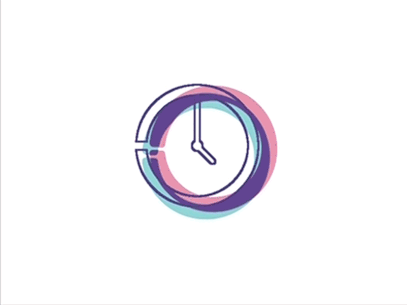

# Linear clock loader

    

This is simple app that was developed to create shot for Uplabs' Loader challange.

## About the code

As this code was prepared only to capture video and forget about it, please don't judge my code skills by the content of java files.

## Libraries

This effect could not be possible without two libraries:

* [RoadRunner](https://github.com/glomadrian/RoadRunner) - for creating vector drawing effect like the clock above 
* [EaseInterpolato](https://github.com/cimi-chen/EaseInterpolator) - set of more advanced animation interpolator than provided by Android 

If you want to create similar effect with your own path, please be sure to fallow this [guide](http://www.useragentman.com/blog/2013/04/26/how-to-create-svg-paths-easily-using-the-gimp/), as RoadRunner is very limited library when it comes to using svg paths.
